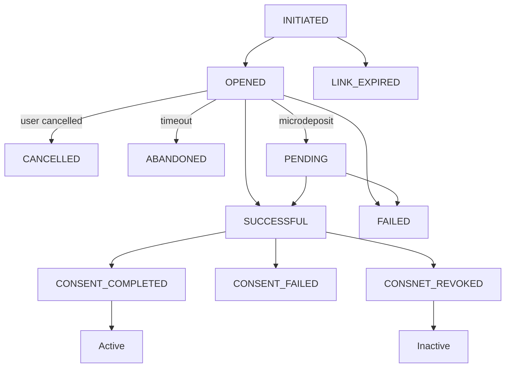
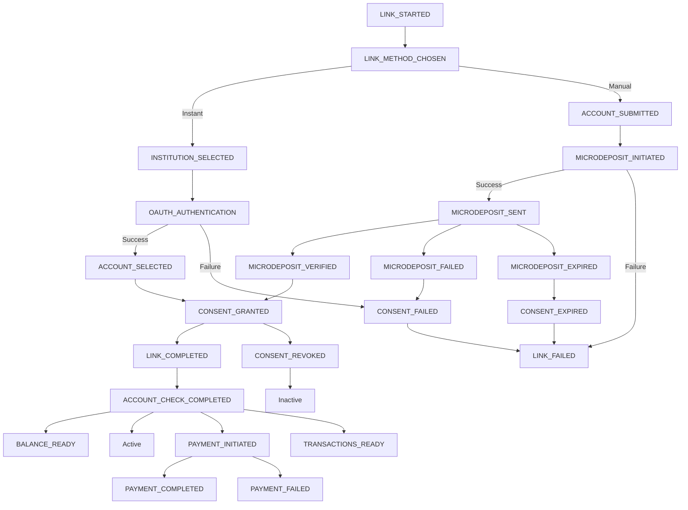

# Pay by Bank Lifecycle Comparison

## 📌 Current Lifecycle Version

### Mermaid Diagram

```mermaid
graph TD
  %% Connect Link Lifecycle
  INITIATED --> OPENED
  OPENED --> SUCCESSFUL
  OPENED -- user cancelled --> CANCELLED
  OPENED --> FAILED
  OPENED -- timeout --> ABANDONED
  OPENED -- microdeposit --> PENDING
  INITIATED --> LINK_EXPIRED
  PENDING --> SUCCESSFUL
  PENDING --> FAILED

  %% Consent Lifecycle
  SUCCESSFUL --> CONSENT_COMPLETED
  SUCCESSFUL --> CONSENT_FAILED
  SUCCESSFUL --> CONSNET_REVOKED

  %% Account Lifecycle
  CONSENT_COMPLETED --> ACCOUNT_ACTIVE[Active]
  CONSNET_REVOKED --> ACCOUNT_INACTIVE[Inactive]
```

```mermaid
graph TD
  %% Link initiation
  LINK_STARTED --> LINK_METHOD_CHOSEN

  %% Instant Link Flow
  LINK_METHOD_CHOSEN -- Instant --> INSTITUTION_SELECTED --> OAUTH_AUTHENTICATION
  OAUTH_AUTHENTICATION -- Success --> ACCOUNT_SELECTED
  OAUTH_AUTHENTICATION -- Failure --> CONSENT_FAILED
  ACCOUNT_SELECTED --> CONSENT_GRANTED

  %% Manual Microdeposit Flow
  LINK_METHOD_CHOSEN -- Manual --> ACCOUNT_SUBMITTED --> MICRODEPOSIT_INITIATED
  MICRODEPOSIT_INITIATED -- Success --> MICRODEPOSIT_SENT
  MICRODEPOSIT_INITIATED -- Failure --> LINK_FAILED
  MICRODEPOSIT_SENT --> MICRODEPOSIT_VERIFIED
  MICRODEPOSIT_SENT --> MICRODEPOSIT_FAILED
  MICRODEPOSIT_SENT --> MICRODEPOSIT_EXPIRED
  MICRODEPOSIT_VERIFIED --> CONSENT_GRANTED
  MICRODEPOSIT_FAILED --> CONSENT_FAILED
  MICRODEPOSIT_EXPIRED --> CONSENT_EXPIRED

  %% Consent Management
  CONSENT_GRANTED --> LINK_COMPLETED
  CONSENT_FAILED --> LINK_FAILED
  CONSENT_EXPIRED --> LINK_FAILED
  CONSENT_GRANTED --> CONSENT_REVOKED

  %% Account Lifecycle
  LINK_COMPLETED --> ACCOUNT_CHECK_COMPLETED
  ACCOUNT_CHECK_COMPLETED --> BALANCE_READY
  ACCOUNT_CHECK_COMPLETED --> ACCOUNT_ACTIVE[Active]
  CONSENT_REVOKED --> ACCOUNT_INACTIVE[Inactive]

  %% Payment & Transactions
  ACCOUNT_CHECK_COMPLETED --> PAYMENT_INITIATED
  PAYMENT_INITIATED --> PAYMENT_COMPLETED
  PAYMENT_INITIATED --> PAYMENT_FAILED
  ACCOUNT_CHECK_COMPLETED --> TRANSACTIONS_READY
```
