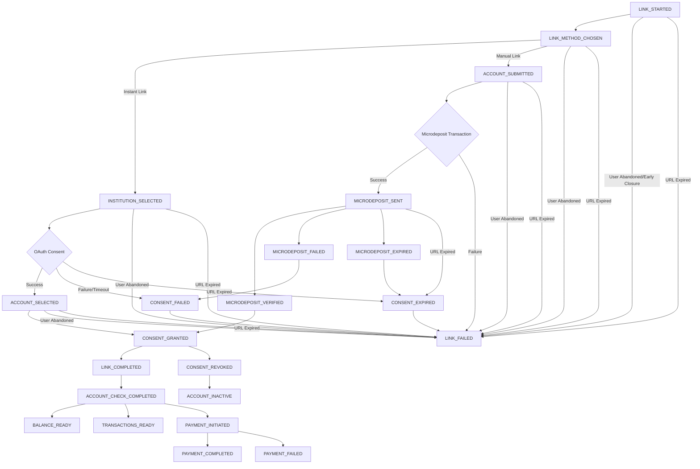

## Pay by Bank Webhook Events Description Table

| Event Name                    | Event Group  | Lifecycle Step          | When It's Sent                                                                            | Substatus                             | Description                                                                               |
| ----------------------------- | ------------ | ----------------------- | ----------------------------------------------------------------------------------------- | ------------------------------------- | ----------------------------------------------------------------------------------------- |
| **LINK\_STARTED**             | LINK         | Initiation              | User initiates the Pay by Bank linking process.                                           |                                       | User initiates the Pay by Bank linking process.                                           |
| **LINK\_METHOD\_CHOSEN**      | LINK         | Method Selection        | User selects either Instant Link (OAuth) or Manual Link (Microdeposit).                   | OAuth, Microdeposit                   | User selects either Instant Link (OAuth) or Manual Link (Microdeposit).                   |
| **INSTITUTION\_SELECTED**     | LINK         | Institution Selection   | User selects their financial institution for linking.                                     |                                       | User selects their financial institution for linking.                                     |
| **OAUTH\_AUTHENTICATION**     | LINK         | OAuth Authentication    | User authenticates via OAuth at their chosen financial institution.                       |                                       | User authenticates via OAuth at their chosen financial institution.                       |
| **ACCOUNT\_SELECTED**         | LINK         | Account Selection       | User selects the account after successful authentication.                                 |                                       | User selects the account they wish to link after successful authentication.               |
| **ACCOUNT\_SUBMITTED**        | MANUAL\_LINK | Manual Submission       | User manually submits account details via microdeposit method.                            |                                       | User manually submits their account details for linking via microdeposit method.          |
| **MICRODEPOSIT\_INITIATED**   | MANUAL\_LINK | Microdeposit Initiation | System initiates microdeposit transactions (2 small credits and 1 debit).                 |                                       | System initiates microdeposit transactions (2 small credits and 1 debit).                 |
| **MICRODEPOSIT\_SENT**        | MANUAL\_LINK | Microdeposit Sent       | Microdeposit transactions successfully sent; user prompted to verify transaction amounts. |                                       | Microdeposit transactions successfully sent; user prompted to verify transaction amounts. |
| **MICRODEPOSIT\_VERIFIED**    | MANUAL\_LINK | Verification Success    | User successfully verifies microdeposit amounts.                                          |                                       | User successfully verifies the microdeposit amounts.                                      |
| **MICRODEPOSIT\_FAILED**      | MANUAL\_LINK | Verification Failure    | User fails to correctly verify microdeposit amounts within allowed attempts.              |                                       | User fails to correctly verify microdeposit amounts within allowed attempts.              |
| **MICRODEPOSIT\_EXPIRED**     | MANUAL\_LINK | Verification Expired    | Microdeposit verification expires due to user inactivity or timeout.                      |                                       | Microdeposit verification expires due to user inactivity or timeout.                      |
| **CONSENT\_GRANTED**          | CONSENT      | Consent Granted         | User successfully grants consent via OAuth or microdeposit verification.                  |                                       | User successfully grants consent via OAuth or microdeposit verification.                  |
| **CONSENT\_FAILED**           | CONSENT      | Consent Failure         | Consent step fails due to user abandonment, OAuth error, or verification failure.         |                                       | Consent step fails due to user abandonment, OAuth error, or verification failure.         |
| **CONSENT\_EXPIRED**          | CONSENT      | Consent Expired         | Consent step expires without user completion.                                             |                                       | Consent step expires without user completion.                                             |
| **CONSENT\_REVOKED**          | CONSENT      | Consent Revoked         | Consent explicitly revoked by user or system after initial granting.                      |                                       | Consent explicitly revoked by user or system after initial granting.                      |
| **LINK\_COMPLETED**           | LINK         | Link Completed          | User successfully completes entire link and consent process.                              | OAuth\_Success, Manual\_Verified      | User successfully completes entire link and consent process.                              |
| **LINK\_FAILED**              | LINK         | Link Failed             | Link process fails or is abandoned at any stage before completion.                        |                                       | Link process fails or is abandoned at any stage before completion.                        |
| **ACCOUNT\_CHECK\_COMPLETED** | ACCOUNT      | Account Validation      | Account validation successful; account details verified.                                  | Verified, Sufficient\_Funds           | Account validation successful; account details verified.                                  |
| **BALANCE\_READY**            | ACCOUNT      | Balance Retrieval       | Account balance successfully retrieved and ready for use.                                 |                                       | Account balance successfully retrieved and ready for use.                                 |
| **TRANSACTIONS\_READY**       | TRANSACTION  | Transactions Ready      | Transaction data successfully fetched and available.                                      |                                       | Transaction data successfully fetched and available.                                      |
| **PAYMENT\_INITIATED**        | PAYMENT      | Payment Initiation      | Payment initiation process has begun.                                                     |                                       | Payment initiation process has begun.                                                     |
| **PAYMENT\_COMPLETED**        | PAYMENT      | Payment Completed       | Payment completed successfully.                                                           |                                       | Payment completed successfully.                                                           |
| **PAYMENT\_FAILED**           | PAYMENT      | Payment Failed          | Payment fails due to insufficient funds or technical issues.                              | Insufficient\_Funds, Technical\_Error | Payment fails due to insufficient funds or technical issues.                              |
| **ACCOUNT\_INACTIVE**         | ACCOUNT      | Account Inactive        | Linked account becomes inactive due to consent revocation or other restrictions.          |                                       | Linked account becomes inactive due to consent revocation or other restrictions.          |


## Pay by Bank Webhook Events

### Common Fields

All webhook events share a common set of core fields:

| Field            | Type   | Description                                       |
|------------------|--------|---------------------------------------------------|
| `eventGroup`     | string | Categorizes the event type                        |
| `consentId`      | string | Unique identifier for the consent                 |
| `consentType`    | string | Type of consent (e.g., Payment)                   |
| `externalUserId` | string | Merchant-provided user identifier                 |
| `country`        | string | Country of the user                               |
| `locale`         | string | Locale or language preference of the user         |
| `referenceId`    | string | Merchant-generated reference for tracking         |

### Event-Specific Additional Fields

Each webhook event includes additional fields in the `data` block depending on its specific context:

#### LINK Events

**LINK_STARTED**
- `linkId`: Unique identifier for the link session.

**LINK_COMPLETED**
- `status`: Possible values:  
  `"OAUTH_SUCCESS"`, `"MANUAL_VERIFIED"`, `"PARTIAL_VERIFIED"`, `"LINKED_MULTIPLE_ACCOUNTS"`

**LINK_FAILED**
- `reason`: Possible values:  
  `"IFRAME_CLOSED"`, `"OAUTH_TIMEOUT"`, `"USER_ABANDONED"`, `"BANK_ERROR"`, `"MICRODEPOSIT_TRANSACTION_FAILED"`, `"SESSION_EXPIRED"`

#### CONSENT Events

**CONSENT_GRANTED**
- `status`: Possible values:  
  `"GRANTED"`, `"RECONFIRMED"`, `"PARTIAL"`

**CONSENT_FAILED**
- `reason`: Possible values:  
  `"OAUTH_FAILED"`, `"MICRODEPOSIT_VERIFICATION_FAILED"`, `"USER_ABANDONED"`, `"BANK_ERROR"`, `"SESSION_EXPIRED"`, `"INVALID_INPUT"`, `"PROVIDER_UNAVAILABLE"`

**CONSENT_EXPIRED**
- `expiredAt`: ISO8601 timestamp when the consent expired.

**CONSENT_REVOKED**
- `revokedAt`: ISO8601 timestamp when the consent was revoked.

#### ACCOUNT Events

**ACCOUNT_CHECK_COMPLETED**
- `verificationStatus`: Possible values:  
  `"VERIFIED"`, `"PARTIALLY_VERIFIED"`, `"INSUFFICIENT_DATA"`, `"FAILED"`
- `accounts`: Array of detailed account information, including:
    - `accountId`, `accountType`, `accountIdentifiers`, `parties`, `status`, `financialInstitutionName`, `financialInstitutionLogo`

**BALANCE_READY**
- `accounts`: Array of accounts with available balances, including:
    - `accountId`, `availableBalance`, `currency`

#### PAYMENT Events

**PAYMENT_COMPLETED**
- `paymentId`: Identifier for the completed payment.
- `amount`: Amount paid.
- `currency`: Currency of the transaction.
- `status`: Possible values:  
  `"SUCCESS"`, `"SETTLED"`, `"CONFIRMED"`

#### TRANSACTION Events

**TRANSACTIONS_READY**
- `accountIds`: Array of account identifiers.
- `transactionCount`: Number of transactions available.

#### MANUAL_LINK Events

**ACCOUNT_SUBMITTED**
- `accountIdentifiers`: Account details (type, number).
- `routingNumber`: Routing number of the submitted account.
- `accountHolderName`: Name associated with the account.
- `submittedAt`: ISO8601 timestamp when account details were submitted.

**MICRODEPOSIT_SENT**
- `sentAt`: ISO8601 timestamp when microdeposits were sent.
- `estimatedPostingDate`: ISO8601 estimated date for deposits to post.

**MICRODEPOSIT_VERIFIED**
- `verifiedAt`: ISO8601 timestamp when microdeposits were verified.

**MICRODEPOSIT_FAILED**
- `reason`: Possible values:  
  `"VERIFICATION_LIMIT_EXCEEDED"`, `"INVALID_AMOUNTS"`, `"BANK_REJECTED"`

**MICRODEPOSIT_EXPIRED**
- `expiredAt`: ISO8601 timestamp when verification expired.

---

### Example Webhook Event Payload

Here’s an example payload illustrating a complete webhook event (`PAYMENT_COMPLETED`):

```json
{
  "specversion": "1.0",
  "id": "evt-1234abcd",
  "type": "PAYMENT_COMPLETED",
  "source": "/paybybank/api/v1/payment",
  "time": "2025-05-30T10:08:00Z",
  "traceId": "trace-001",
  "requestId": "req-001",
  "data": {
    "referenceId": "ref-001",
    "eventGroup": "PAYMENT",
    "consentId": "consent-123",
    "paymentId": "payment-001",
    "amount": 150.00,
    "currency": "USD",
    "status": "SUCCESS",
    "consentType": "Payment",
    "externalUserId": "user-001",
    "country": "US",
    "locale": "en-US"
  }
}

{
  "eventGroup": "ACCOUNT",
  "consentId": "string",
  "accounts": [
    {
      "accountId": "string",
      "accountType": "string",
      "accountIdentifiers": [
        {
          "accountIdType": "string",
          "accountIdValue": "string"
        }
      ],
      "name": "string",
      "parties": [
        {
          "name": "string",
          "role": "string"
        }
      ],
      "status": "string",
      "financialInstitutionName": "string",
      "financialInstitutionLogo": "string"
    }
  ],
  "verificationStatus": "string",
  "consentType": "string",
  "externalUserId": "string",
  "country": "string",
  "locale": "string"
}