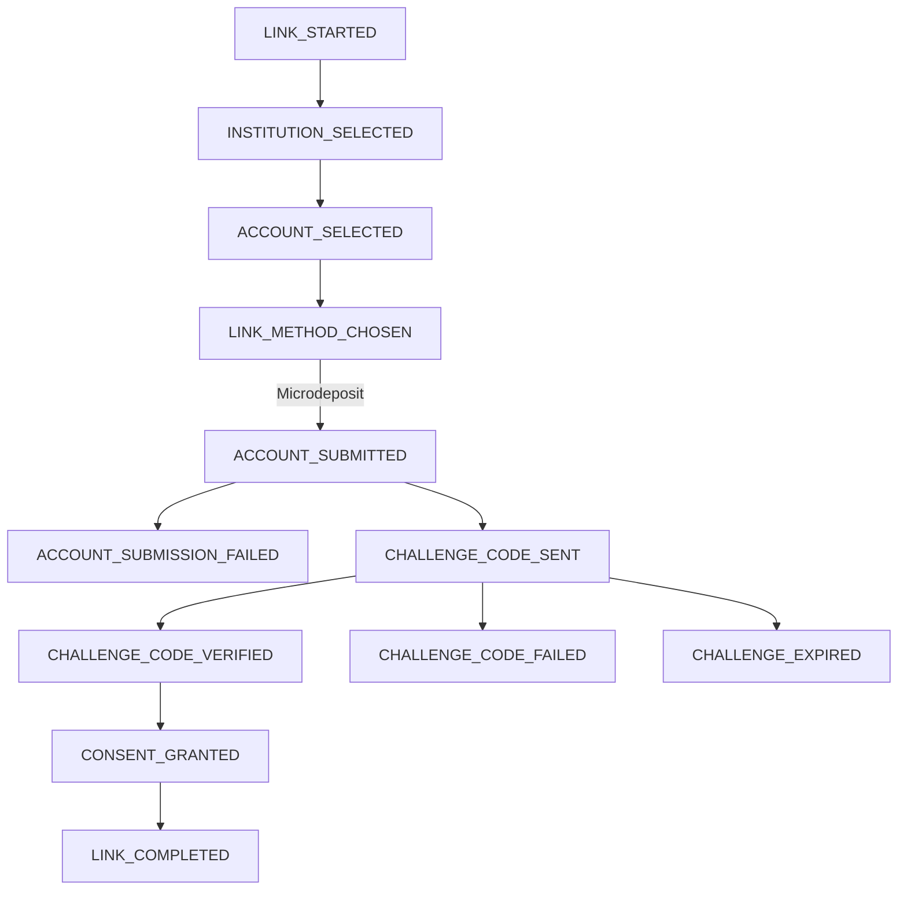

# Webhook Lifecycle to Event Mapping

## 📦 Webhook Event Table

| #  | Lifecycle Step            | Webhook Event Group | Webhook Event Type         | When It's Sent                                                   | Notes |
|----|---------------------------|---------------------|----------------------------|-------------------------------------------------------------------|-------|
| 1  | LINK_STARTED              | LINK                | LINK_STARTED               | As soon as user starts link session                              | First event in the journey |
| 2  | Institution selected      | LINK                | INSTITUTION_SELECTED       | After institution is chosen by user                              | OAuth or manual flow |
| 3  | Account selected          | LINK                | ACCOUNT_SELECTED           | After user selects account                                        | Used before consent/verification |
| 4  | Link method chosen        | LINK                | LINK_METHOD_CHOSEN         | After user selects OAuth or Microdeposit                         | `subStatus`: `OAUTH`, `MICRODEPOSIT` |
| 5  | Manual account submitted  | MANUAL_LINK         | ACCOUNT_SUBMITTED          | When user manually enters account/routing number                 | Precedes challenge code |
| 6  | Challenge code sent       | MANUAL_LINK         | CHALLENGE_CODE_SENT        | After sending micro-deposit or code                              | Manual link flow only |
| 7  | Challenge code verified   | MANUAL_LINK         | CHALLENGE_CODE_VERIFIED    | Upon successful verification (e.g., deposit matched)             | Indicates verified account |
| 8  | Challenge code failed     | MANUAL_LINK         | CHALLENGE_CODE_FAILED      | On failed attempt or after max retries                           | Optional retry logic |
| 9  | Challenge expired         | MANUAL_LINK         | CHALLENGE_EXPIRED          | After timeout (e.g., user didn’t verify in time)                 | Use TTL or timeouts |
| 10 | Consent granted           | CONSENT             | CONSENT_GRANTED            | After OAuth or challenge verification is completed successfully  | Key milestone |
| 11 | Consent failed            | CONSENT             | CONSENT_FAILED             | When user abandons flow or an error occurs                       | Include reason in `subStatus` |
| 12 | Consent expired           | CONSENT             | CONSENT_EXPIRED            | If user doesn't complete link within TTL                         | TTL can be 15–20 minutes |
| 13 | Consent revoked           | CONSENT             | CONSENT_REVOKED            | When user or API revokes the consent                             | Manual or system-triggered |
| 14 | Link completed            | LINK                | LINK_COMPLETED             | Once account is linked (OAuth or verified challenge)             | `subStatus`: `OAUTH_SUCCESS`, `MANUAL_VERIFIED` |
| 15 | Link failed               | LINK                | LINK_FAILED                | If iframe closed, bank timeout, or user abandoned                | Includes retry or fallback |
| 16 | Account check completed   | ACCOUNT             | ACCOUNT_CHECK_COMPLETED    | After consented account’s info and balance validated             | `subStatus`: `SUFFICIENT_FUNDS`, etc. |
| 17 | Transactions ready        | TRANSACTION         | TRANSACTIONS_READY         | When transaction data is fetched successfully                    | One-time or batch pull |
| 18 | Payment initiated         | PAYMENT             | PAYMENT_INITIATED          | When payment flow begins (e.g., ACH push)                        | |
| 19 | Payment completed         | PAYMENT             | PAYMENT_COMPLETED          | On payment settlement success                                    | |
| 20 | Payment failed            | PAYMENT             | PAYMENT_FAILED             | On payment rejection or error                                    | `subStatus`: `INSUFFICIENT_FUNDS`, etc. |

---

## 🧭 Mermaid Diagram




```mermaid
graph TD
  A[LINK_STARTED]
  B[INSTITUTION_SELECTED]
  C[ACCOUNT_SELECTED]
  D[LINK_METHOD_CHOSEN]
  E1[CONSENT_GRANTED]
  E2[CONSENT_FAILED]
  E3[CONSENT_EXPIRED]
  E4[CONSENT_REVOKED]
  F1[CHALLENGE_CODE_SENT]
  F2[CHALLENGE_CODE_VERIFIED]
  F3[CHALLENGE_CODE_FAILED]
  F4[CHALLENGE_EXPIRED]
  G[LINK_COMPLETED]
  H[LINK_FAILED]
  I[ACCOUNT_CHECK_COMPLETED]
  J[TRANSACTIONS_READY]
  K1[PAYMENT_INITIATED]
  K2[PAYMENT_COMPLETED]
  K3[PAYMENT_FAILED]

  A --> B --> C --> D
  D -->|OAuth| E1
  D -->|Microdeposit| F1 --> F2 --> E1
  F1 --> F3
  F1 --> F4
  E1 --> G
  D --> H
  E1 --> I --> J
  E1 --> K1 --> K2
  K1 --> K3
  E2 --> H
  E3 --> H
  E4 --> H
  ```

```mermaid
graph TD
  A[LINK_STARTED]
  B[LINK_METHOD_CHOSEN]
  C[INSTITUTION_SELECTED]
  L[USER_LOGIN_STARTED]
  D[ACCOUNT_SELECTED]
  E1[CONSENT_GRANTED]
  E2[CONSENT_FAILED]
  G[LINK_COMPLETED]

  S[ACCOUNT_SUBMITTED]
  SF[ACCOUNT_SUBMISSION_FAILED]
  F1[CHALLENGE_CODE_SENT]
  F2[CHALLENGE_CODE_VERIFIED]
  F3[CHALLENGE_CODE_FAILED]
  F4[CHALLENGE_EXPIRED]

  A --> B --> C
  B -->|OAuth| L --> D --> E1 --> G
  C -->|Manual| S --> F1 --> F2 --> E1
  S --> SF
  F1 --> F3
  F1 --> F4
```  